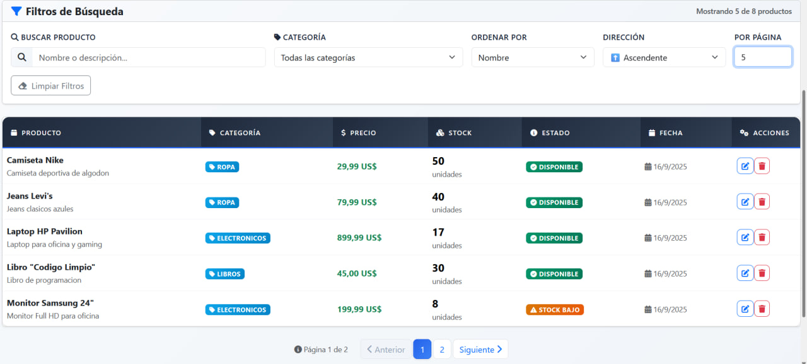
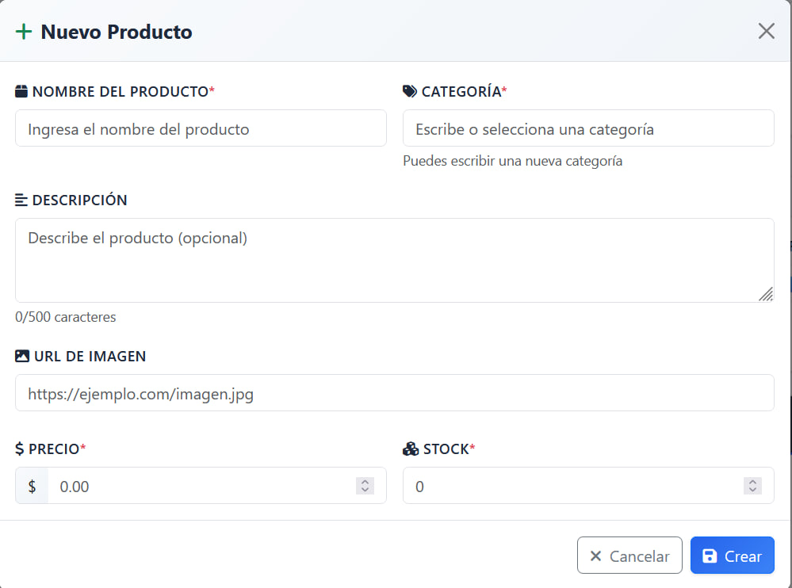
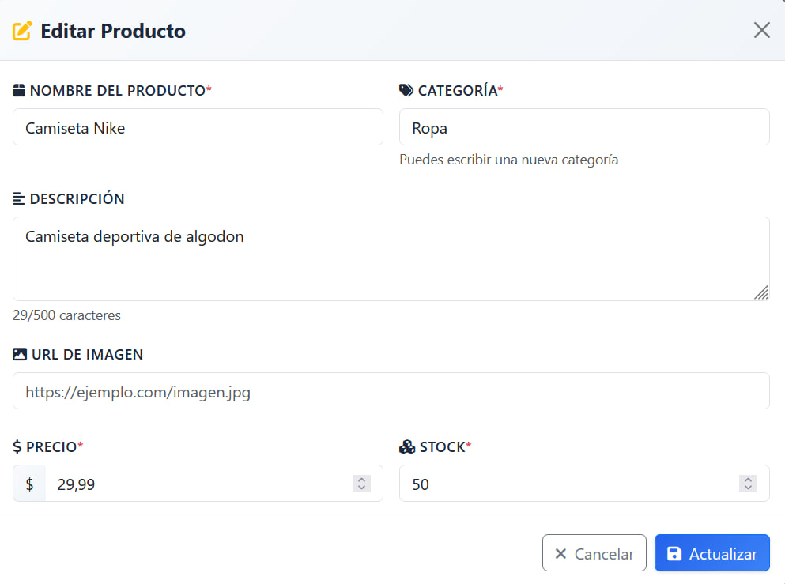
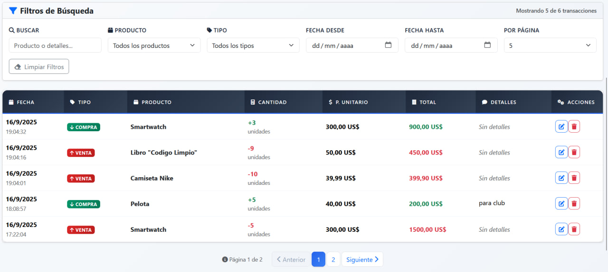
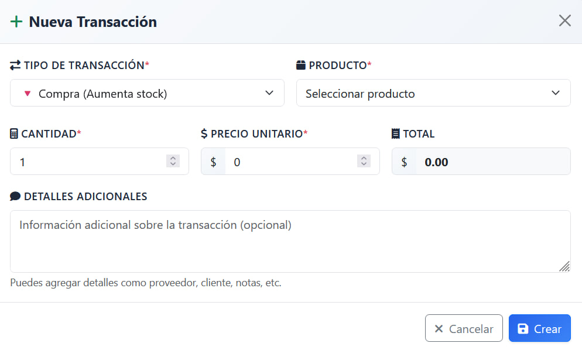
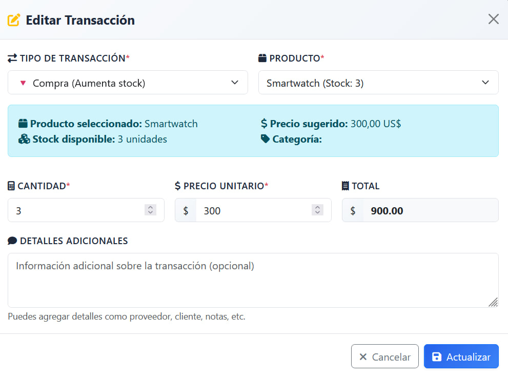
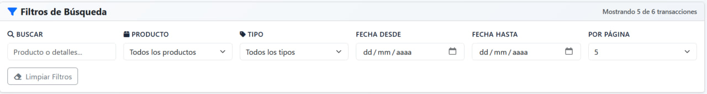
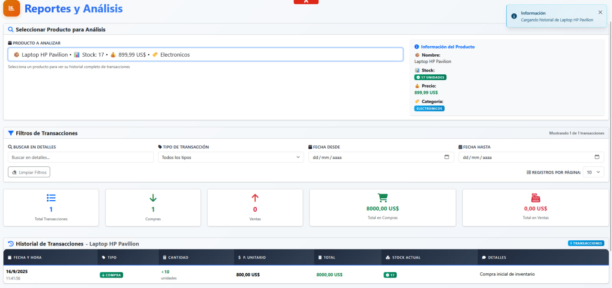

# Sistema de Gestión de Inventarios

## Descripción del Proyecto

Sistema web completo para la gestión de inventarios desarrollado con arquitectura de microservicios. Permite administrar productos, registrar transacciones de compra/venta, y generar reportes con filtros avanzados.

### Características Principales

- **Gestión de Productos**: CRUD completo con categorización y control de stock
- **Gestión de Transacciones**: Registro de compras y ventas con actualización automática de inventario
- **Reportes y Filtros**: Análisis avanzado
- **Interfaz Moderna**: Diseño responsivo con notificaciones en tiempo real
- **Arquitectura Escalable**: Microservicios independientes para productos y transacciones

### Tecnologías Utilizadas

**Backend:**
- .NET 8.0
- Entity Framework Core
- SQL Server
- ASP.NET Core Web API
- Arquitectura de Microservicios

**Frontend:**
- React 19.x
- TypeScript
- Bootstrap 5.3
- Vite
- Font Awesome

---

## Requisitos

### Requisitos del Sistema

- **Sistema Operativo**: Windows 10/11, macOS, o Linux
- **RAM**: Mínimo 4GB (Recomendado 8GB)
- **Disco**: Al menos 2GB de espacio libre
- **Conexión a Internet**: Para descarga de dependencias

### Software Necesario

#### Para el Backend (.NET)
- **.NET 8.0 SDK** - [Descargar aquí](https://dotnet.microsoft.com/download/dotnet/8.0)
- **SQL Server** (una de las siguientes opciones):
  - SQL Server 2019/2022 (Local o Express)
  - SQL Server LocalDB (incluido con Visual Studio)
  - Docker con SQL Server container

#### Para el Frontend (React)
- **Node.js 18.x o superior** - [Descargar aquí](https://nodejs.org/)
- **npm** (incluido con Node.js) o **yarn**

#### Herramientas de Desarrollo (Recomendadas)
- **Visual Studio 2022** o **Visual Studio Code**
- **SQL Server Management Studio (SSMS)**
- **Git** - [Descargar aquí](https://git-scm.com/)

#### Verificar Instalaciones

Ejecutar en terminal/command prompt:

```bash
# Verificar .NET
dotnet --version
# Debería mostrar: 8.0.x

# Verificar Node.js
node --version
# Debería mostrar: v18.x.x o superior

# Verificar npm
npm --version
# Debería mostrar: 9.x.x o superior
```

---

## Ejecución del Backend

### 1. Preparar la Base de Datos

#### Opción A: MySQL con XAMPP

**Iniciar servicios:**
1. Abrir el panel de control de XAMPP
2. Iniciar **Apache** y **MySQL**
3. Verificar que MySQL esté corriendo en el puerto 3306

**Ejecutar el script de base de datos:**

**Método 1 - PowerShell (Recomendado):**
```powershell
# Navegar al directorio del proyecto
cd ruta/del/proyecto

# Ejecutar el script (ajusta la ruta de XAMPP si es diferente)
Get-Content ".\bd.sql" | & "C:\xampp\mysql\bin\mysql.exe" -u root -p

# Te pedirá la contraseña (por defecto en XAMPP suele ser vacía, solo presiona Enter)
```

**Método 2 - phpMyAdmin:**
```
1. Abrir http://localhost/phpmyadmin
2. Ir a la pestaña "SQL"
3. Copiar y pegar el contenido de bd.sql
4. Hacer clic en "Continuar"
```

**Método 3 - Línea de comandos:**
```cmd
# Navegar a la carpeta de MySQL en XAMPP
cd C:\xampp\mysql\bin

# Ejecutar el script
mysql.exe -u root -p < "ruta_completa_del_proyecto\bd.sql"
```

#### Opción B: MySQL Standalone (fuera de XAMPP)

**Verificar instalación de MySQL:**
```bash
# Verificar que MySQL esté instalado y corriendo
mysql --version

# Verificar que el servicio esté activo
# Windows:
net start mysql
# o
services.msc (buscar MySQL)

# Linux/Mac:
sudo systemctl status mysql
# o
brew services list | grep mysql
```

**Ejecutar el script de base de datos:**

**Método 1 - PowerShell (Windows):**
```powershell
# Ejecutar el script con MySQL standalone
Get-Content ".\bd.sql" | mysql -u root -p

# Si tienes MySQL en PATH personalizado:
Get-Content ".\bd.sql" | & "C:\Program Files\MySQL\MySQL Server 8.0\bin\mysql.exe" -u root -p
```

**Método 2 - Terminal (Linux/Mac):**
```bash
# Ejecutar el script
mysql -u root -p < bd.sql

# O conectar primero y luego ejecutar:
mysql -u root -p
source /ruta/completa/del/bd.sql;
```

**Método 3 - MySQL Workbench:**
```
1. Abrir MySQL Workbench
2. Conectar a tu instancia de MySQL
3. Abrir el archivo bd.sql
4. Ejecutar el script (Ctrl+Shift+Enter)
```

#### Opción C: MySQL con Docker

```bash
# Ejecutar MySQL en Docker
docker run --name mysql-inventory -e MYSQL_ROOT_PASSWORD=tu_password -p 3306:3306 -d mysql:8.0

# Esperar a que arranque (30-60 segundos)
docker logs mysql-inventory

# Ejecutar el script
docker exec -i mysql-inventory mysql -u root -ptu_password < bd.sql

# O copiar el script al contenedor y ejecutarlo:
docker cp bd.sql mysql-inventory:/tmp/
docker exec -it mysql-inventory mysql -u root -ptu_password -e "source /tmp/bd.sql"
```

### 2. Configurar Conexiones de Base de Datos

#### Para el Microservicio de Productos

> **Nota**: Si usas SQL Server con autenticación por usuario/contraseña, cambia la cadena de conexión:
> ```
> "Server=localhost;Database=gestion_inventario;User Id=sa;Password=YourPassword;TrustServerCertificate=true;"
> ```

### 3. Ejecutar los Microservicios

#### Terminal 1 - Microservicio de Productos
```bash
# Navegar al directorio del proyecto
cd backend/Productos

# Restaurar dependencias
dotnet restore

# Ejecutar el servicio
dotnet run
```

El servicio estará disponible en: `https://localhost:7001`

#### Terminal 2 - Microservicio de Transacciones
```bash
# Navegar al directorio del proyecto
cd backend/Transacciones

# Restaurar dependencias
dotnet restore

# Ejecutar el servicio
dotnet run
```

El servicio estará disponible en: `https://localhost:7002`

### 4. Verificar el Backend

Abrir en el navegador:
- **Productos API**: `https://localhost:7001/swagger`
- **Transacciones API**: `https://localhost:7002/swagger`

Deberías ver la documentación Swagger de cada API.

### Solución de Problemas Comunes

#### Error de Conexión a Base de Datos
```bash
# Verificar que SQL Server esté ejecutándose
# En Windows, abrir Services.msc y buscar "SQL Server"

# Probar conexión con SSMS usando la misma cadena de conexión
```

#### Error de Certificado SSL
```bash
# Confiar en el certificado de desarrollo
dotnet dev-certs https --trust
```

#### Puerto ocupado
```bash
# Cambiar puertos en launchSettings.json de cada proyecto
# O terminar procesos que usen los puertos 7001 y 7002
```

---

## Ejecución del Frontend

### 1. Instalar Dependencias

```bash
# Navegar al directorio del frontend
cd frontend/inventario-front

# Instalar dependencias con npm
npm install

# O con yarn (si prefieres)
yarn install
```

### 2. Configurar Variables de Entorno

Crear archivo `.env` en `Frontend/inventario-app/`:

```env
# URLs de las APIs del backend
VITE_PRODUCTOS_API_URL=https://localhost:7001
VITE_TRANSACCIONES_API_URL=https://localhost:7002

# Configuración de desarrollo
VITE_ENV=development
```

### 3. Verificar Configuración de APIs

Editar `src/services/api.ts` si es necesario:

```typescript
const API_BASE_URL = 'https://localhost:7001';
const TRANSACTION_API_URL = 'https://localhost:7002';
```

### 4. Ejecutar el Frontend

```bash
# Ejecutar en modo desarrollo
npm run dev

# O con yarn
yarn dev
```

El frontend estará disponible en: `http://localhost:5173`

### 5. Construcción para Producción

```bash
# Generar build de producción
npm run build

# Preview del build
npm run preview
```

### Solución de Problemas Comunes

#### Error de CORS
- Verificar que las URLs del frontend estén en `appsettings.json` de ambas APIs
- Reiniciar los servicios del backend después de cambios en CORS

#### Error de Conexión a APIs
```bash
# Verificar que ambas APIs estén ejecutándose
curl https://localhost:7001/api/productos
curl https://localhost:7002/api/transacciones
```

#### Error de Dependencias
```bash
# Limpiar caché y reinstalar
npm cache clean --force
rm -rf node_modules
rm package-lock.json
npm install
```

#### Font Awesome no se muestra
Verificar que esté incluido en `public/index.html`:
```html
<link rel="stylesheet" href="https://cdnjs.cloudflare.com/ajax/libs/font-awesome/6.4.0/css/all.min.css">
```

---

## Evidencias

### 1. Listado Dinámico de Productos con Paginación



**Funcionalidades mostradas:**
- Tabla responsive con información completa de productos
- Paginación con navegación entre páginas
- Filtros de búsqueda por nombre y categoría
- Ordenamiento dinámico por diferentes campos
- Indicadores visuales de estado de stock
- Estadísticas generales (total productos, categorías, etc.)

### 2. Pantalla para la Creación de Productos



**Funcionalidades mostradas:**
- Modal con formulario completo de creación
- Validación en tiempo real de campos obligatorios
- Selector de categorías con opción de crear nuevas
- Campos para precio, stock, descripción e imagen
- Feedback visual de errores de validación
- Notificaciones de éxito/error

### 3. Pantalla para la Edición de Productos



**Funcionalidades mostradas:**
- Modal pre-poblado con datos del producto existente
- Mismas validaciones que creación
- Categoría correctamente seleccionada al cargar
- Botones de acción diferenciados (Actualizar vs Crear)
- Manejo de estados de carga

### 4. Listado Dinámico de Transacciones con Paginación



**Funcionalidades mostradas:**
- Tabla con historial completo de transacciones
- Filtros avanzados (fecha, tipo, producto, búsqueda)
- Paginación eficiente para grandes volúmenes de datos
- Indicadores visuales por tipo de transacción (compra/venta)
- Estadísticas de resumen (total transacciones, balance, etc.)
- Formato de moneda y fechas localizadas

### 5. Pantalla para la Creación de Transacciones



**Funcionalidades mostradas:**
- Formulario con selección de tipo (compra/venta)
- Selector de productos con información de stock disponible
- Validación de stock para ventas
- Cálculo automático de total
- Sugerencia de precio basado en el producto
- Campo de detalles opcional para notas adicionales

### 6. Pantalla para la Edición de Transacciones



**Funcionalidades mostradas:**
- Modal con datos de transacción existente
- Validación de stock considerando la transacción actual
- Información contextual del producto seleccionado
- Recálculo automático de totales
- Advertencias de impacto en inventario

### 7. Pantalla de Filtros Dinámicos



**Funcionalidades mostradas:**
- Selección de producto para análisis detallado
- Múltiples filtros combinables (fechas, tipo, búsqueda)

### 8. Pantalla de Consulta de Información (Extra)



**Funcionalidades mostradas:**
- Vista de estadísticas generales del sistema
- Cards con métricas importantes
- Indicadores de estado de stock
- Resumen de actividad reciente
- Visualización de histórica completo por producto
- Diseño responsive y moderno

---

## Contribución

1. Fork el proyecto
2. Crear rama para feature (`git checkout -b feature/nueva-caracteristica`)
3. Commit cambios (`git commit -am 'Agregar nueva característica'`)
4. Push a la rama (`git push origin feature/nueva-caracteristica`)
5. Crear Pull Request

---

## Licencia

Este proyecto está bajo la Licencia MIT - ver el archivo [LICENSE](LICENSE) para más detalles.

---

## Autor

**Tu Nombre**
- GitHub: [iArkade](https://github.com/iArkade)
- Email: isaacvelasco2000@gmail.com

---

## Agradecimientos

- Tecnologías utilizadas: .NET, React, Bootstrap
- Iconos: Font Awesome
- Estilos base: Bootstrap 5.3

---